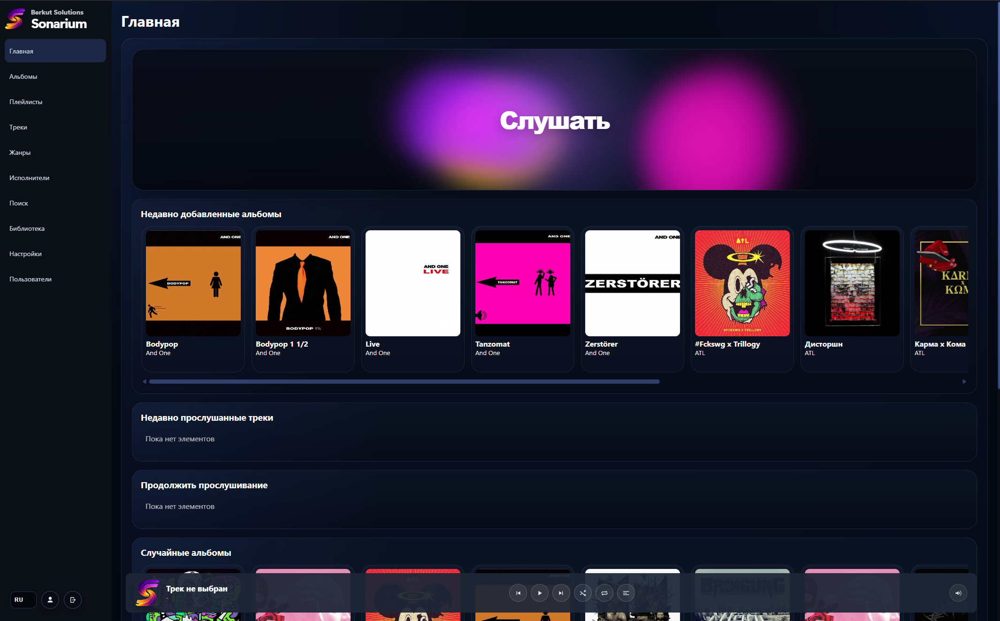
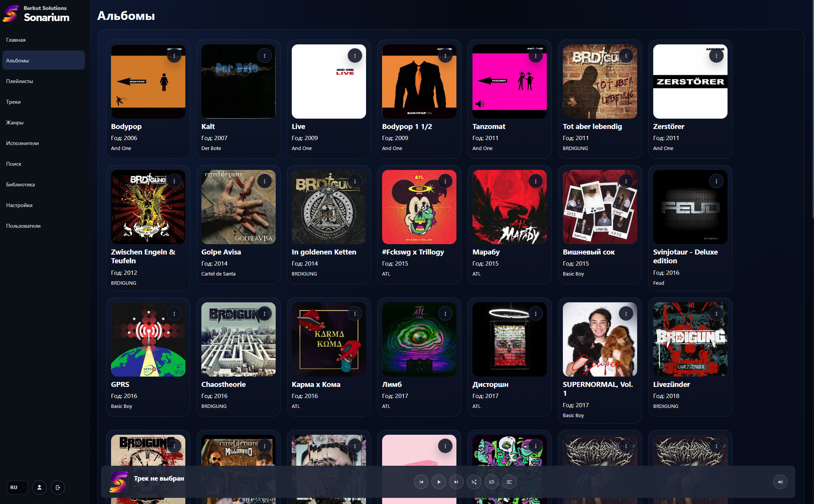
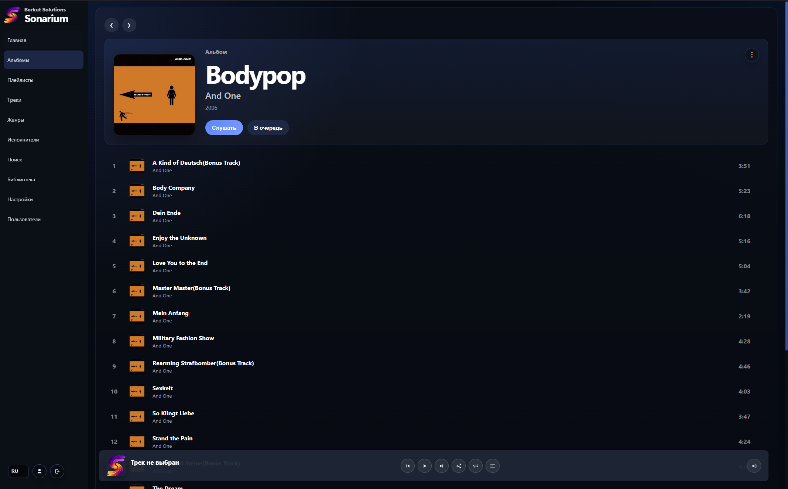

# Berkut Solutions - Sonarium

<p align="center">
  
</p>

[English version](README.en.md)

Sonarium - self-hosted музыкальная платформа для локальной библиотеки: стриминг, умный плеер, коллекции, совместный доступ и современный web-интерфейс без внешних SaaS-зависимостей.

Актуальная версия: `1.0.4`

## Что нового в 1.0.4

- Свертываемое боковое меню и обновленные иконки навигации.
- Улучшенная загрузка музыки в библиотеке:
  - опция `Не загружать дубликаты` (включена по умолчанию);
  - поиск дублей по названию и по метаданным (`title + artist + genre`);
  - история загрузок с сохранением результатов (`загружено / пропущено / ошибки`).
- Улучшен merge альбомов:
  - поиск целевого альбома;
  - при пустом поиске — обычный выпадающий список, отсортированный по алфавиту.
- Добавлены панели сортировки на основных вкладках:
  - Альбомы
  - Исполнители
  - Треки
- Обновлен блок «Волна» на главной:
  - выбор жанра под кнопкой «Слушать»;
  - если жанр не выбран, воспроизводятся все треки.
- Улучшения плеера:
  - переход на страницу текущего трека по клику в плеере;
  - исправлено восстановление состояния после перезагрузки страницы;
  - доработаны плавность и визуальное выравнивание элементов.
- Улучшение удобства sidebar:
  - сворачивание/разворачивание доступно по клику на логотип/бренд в боковом меню.

## Что это за продукт

Sonarium объединяет локальные треки, альбомы, исполнителей, плейлисты и пользовательские сценарии в одном интерфейсе. Проект рассчитан на self-hosted установку: музыка, база данных и служебные данные остаются в вашем контуре, а приложение дает полноценный UI для прослушивания, каталогизации и совместного доступа.

## Для кого подходит

- Тем, кто хочет хранить музыкальную библиотеку локально и не зависеть от внешних стриминговых сервисов.
- Командам и семьям, которым нужен общий доступ к плейлистам и коллекциям с разграничением прав.
- Пользователям с большой библиотекой, где важны жанры, поиск дублей, редактирование метаданных и удобная навигация.
- Тем, кому нужен современный web UI с deep-link страницами, а не набор модальных окон.

## Основные возможности

- Каталог и навигация:
  - отдельные страницы для альбомов, исполнителей, треков, плейлистов, жанров и профилей
  - поиск по библиотеке
  - фильтрация и поиск дублей по названию треков
- Встроенный плеер:
  - очередь воспроизведения
  - drag-and-drop перестановка треков
  - shuffle / repeat
  - waveform и progress UI
  - восстановление состояния между сессиями
- Работа с библиотекой:
  - сканирование музыкальной директории
  - загрузка отдельных файлов и целых папок
  - чтение metadata, cover art и жанров из тегов
  - редактирование альбомов, треков, исполнителей и плейлистов
  - объединение альбомов и исполнителей
- Совместная работа:
  - публичные ссылки на сущности
  - доступ к плейлистам для listener / editor
  - просмотр пользовательских профилей
  - раздел "поделились со мной"
- Администрирование:
  - первый пользователь автоматически становится администратором
  - управление пользователями
  - включение и отключение регистрации
  - проверка обновлений в настройках
  - статистика по занимаемому месту библиотеки
  - настройка параллельной загрузки
- Совместимость:
  - REST API
  - Subsonic adapter (`/rest`)

## Безопасность и доступ

- Zero-trust авторизация с сессиями.
- Приложение закрыто для неавторизованных пользователей.
- Разделение обычных пользовательских и административных прав.
- Доступ к профилям и shared-сущностям контролируется на серверной стороне.

## Технический профиль

- Backend: Go
- Database: PostgreSQL
- Deployment: Docker / Docker Compose
- Media stack: FFmpeg
- Migrations: Goose

## Скриншоты

Текущие скриншоты из репозитория:

- `gui/static/screen1.png`
- `gui/static/screen2.png`
- `gui/static/screen3.png`





## Быстрый запуск

1. Скопируйте пример env:

```bash
cp .env.example .env
```

2. Запустите стек:

```bash
docker compose up -d --build
```

3. Откройте приложение:

```text
http://localhost:8080
```

4. Создайте первого пользователя. Он автоматически станет администратором.

## Docker volumes

Проект использует отдельные Docker named volumes:

- `postgres_data` - PostgreSQL
- `soundhub_data` - сервисные данные, кэш, thumbnails
- `soundhub_music` - музыкальная библиотека

Проверка:

```bash
docker volume ls
```

Полное удаление стека вместе с данными:

```bash
docker compose down -v
```

## Документация

- Общий индекс: [docs/README.md](docs/README.md)
- Русская документация: [docs/ru/README.md](docs/ru/README.md)
- English docs: [docs/eng/README.md](docs/eng/README.md)

Основные документы:
- Архитектура: [docs/architecture.md](docs/architecture.md)
- API: [docs/api.md](docs/api.md)
- Docker strategy: [docs/docker_strategy.md](docs/docker_strategy.md)
- Модули: [docs/modules.md](docs/modules.md)
- Структура репозитория: [docs/repository_structure.md](docs/repository_structure.md)

## Лицензия

[LICENSE](LICENSE)
